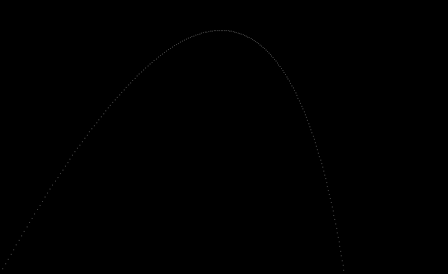
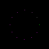

# Rust Ray Tracer

My attempt at implementing a _ray tracer from scratch in Rust. This is in order to learn the language.

## Examples:

### Plotting a projectile

### Drawing a clock

### Rendering a sphere (no shadow, flat)

